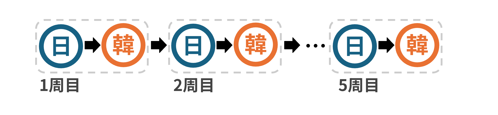
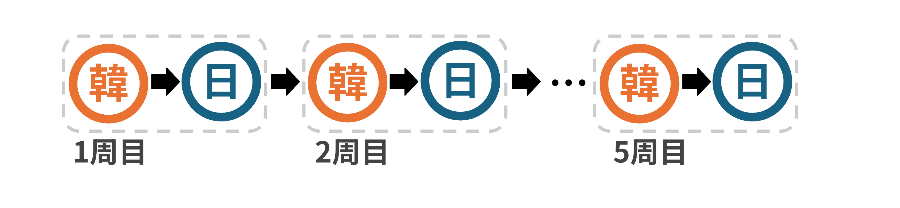
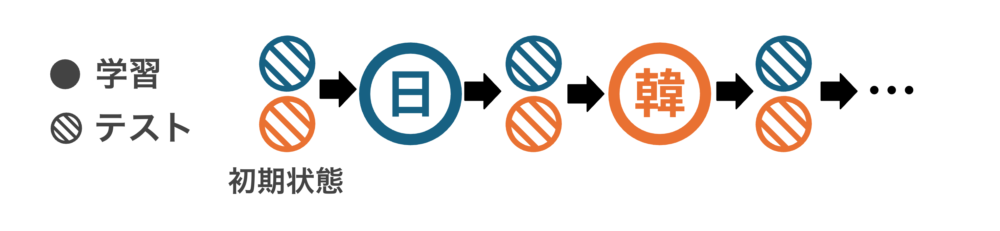

# Sequential Multilingual Training with mBERT (Japanese ↔ Korean)

本リポジトリは，  
**多言語BERT (mBERT) を用いた日本語・韓国語ニュース分類タスクにおける逐次学習 (Sequential Multilingual Training)**  
の実験コードを公開するものである。

本研究では，

- 日本語ニュース分類
- 韓国語ニュース分類

という2つのテキスト分類タスクを対象に，

- 日本語 → 韓国語
- 韓国語 → 日本語

という **異なる学習順序** によってモデル性能がどのように変化するかを分析する。

特に，

- クロスリンガル知識転移 (Cross-lingual Transfer)
- 忘却 (Catastrophic Forgetting)
- 多言語モデルの逐次適応能力

を観察することを目的としている。

---

# Repository Structure

```
bert-CCL/
├── data/
│ └── ja/
│ ├── livedoor_sentence_train.csv
│ └── livedoor_sentence_test.csv
│
├── scripts/
│ ├── train.py
│ └── evaluate.py
│
├── src/
│ ├── models/
│ │ └── bert_classifier.py
│ │
│ ├── data/
│ │ ├── ja_dataset.py
│ │ └── ko_dataset.py
│ │
│ ├── training/
│ │ └── trainer.py
│ │
│ ├── evaluation/
│ │ └── evaluator.py
│ │
│ └── utils/
│ └── seed.py
│
└── README.md
```

---

# Tasks

本研究では以下の2つの分類タスクを扱う。

## Japanese News Classification

データセット：

- **Livedoor ニュースコーパス**

入力：


```sentence```


ラベル：

```
0
1
2
```

---

## Korean News Classification

データセット：

- **KLUE YNAT**

https://huggingface.co/datasets/klue

使用ラベル：

```
0 (IT)
3 (生活文化)
5 (スポーツ)
```

これらを以下の3クラスに再マッピングする：

```
0 → 0
3 → 1
5 → 2
```

---

# Model

本研究では **mBERT (bert-base-multilingual-uncased)** を使用する。

---

# Installation

必要ライブラリ：

```
pip install torch transformers datasets tqdm pandas
```

---

# Training

## 日本語モデルの学習

```
python scripts/train.py --lang ja
```

---

## 韓国語モデルの学習

```
python scripts/train.py --lang ko
```

---

# Sequential Training

## Japanese → Korean



まず日本語で学習：

```
python scripts/train.py --lang ja
```

次にそのモデルを初期値として韓国語を学習：

```
python scripts/train.py
--lang ko
--init_checkpoint checkpoints/ja/scratch/best_model_state.bin
--save_dir checkpoints/ja_to_ko
```

---

## Korean → Japanese



まず韓国語で学習：

```
python scripts/train.py --lang ko
```

その後日本語を学習：

```
python scripts/train.py
--lang ja
--init_checkpoint checkpoints/ko/scratch/best_model_state.bin
--save_dir checkpoints/ko_to_ja
```

---

# Evaluation

## 学習済みモデルの評価



例：

```
python scripts/evaluate.py
--lang ja
--checkpoint checkpoints/ja/scratch/best_model_state.bin
```

---

## ベースラインモデル（未学習分類ヘッド）

```
python scripts/evaluate.py --lang ja
python scripts/evaluate.py --lang ko
```

---

# Notes

- 乱数固定は `seed_everything()` によって管理される
- GPU が利用可能な場合，自動的に CUDA が使用される

---

# License

This project is released for academic research purposes.

